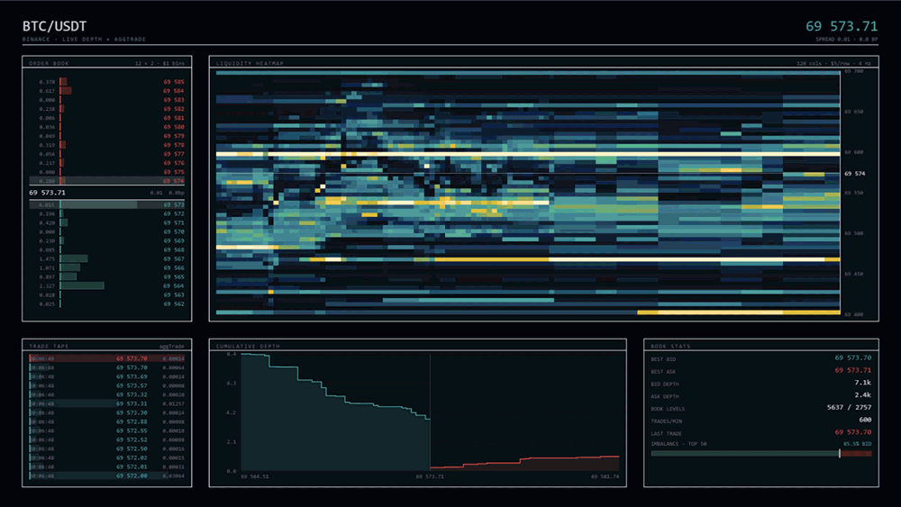
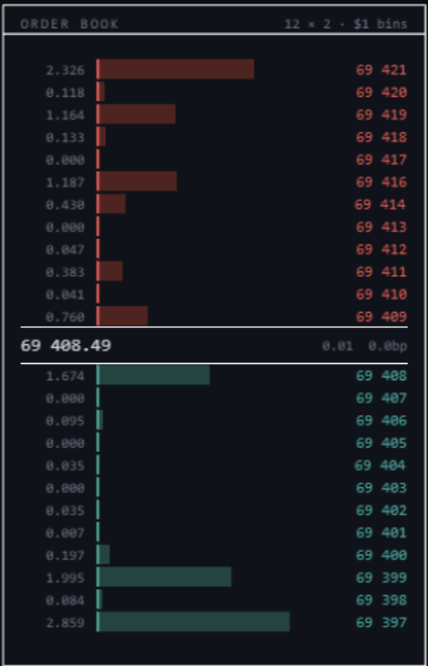
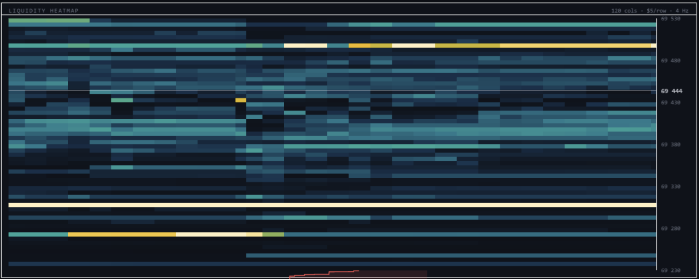
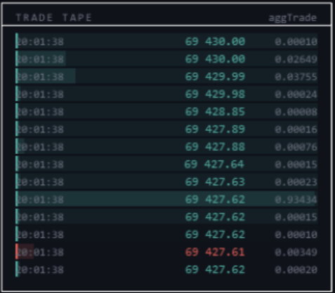
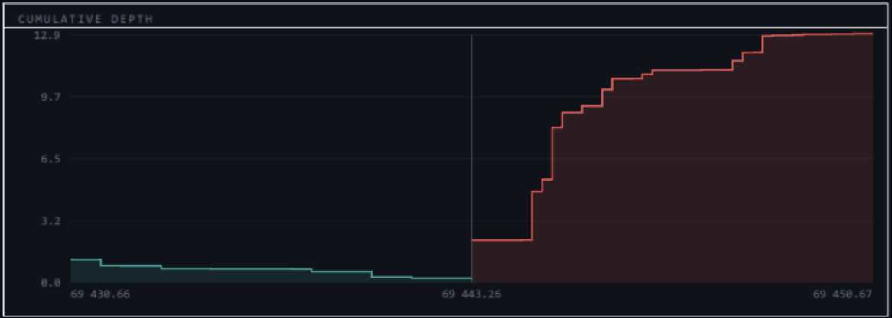
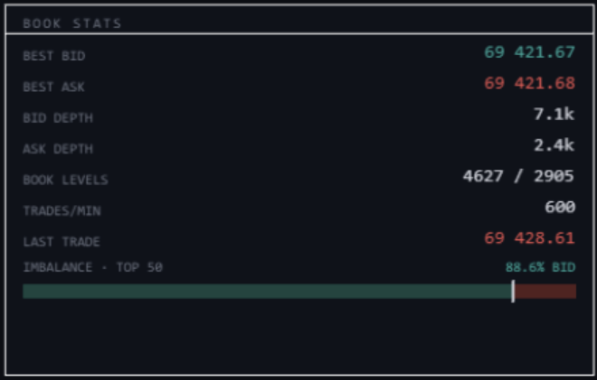

# Order Book Visualizer

Live limit order book for BTC/USDT, running in the browser. It rebuilds Binance's book
from their diff stream and draws it with Pixi.js: price ladder, liquidity heatmap, trade
tape, depth curve, book stats.

**[Live demo →](https://victormorris.github.io/orderbook-visualizer/)**



---

## What this is

Three pieces:

1. A matching engine. Price-time priority limit order book, written from scratch, no
   dependencies. Crossing orders match the opposite side from the best price inward,
   print at the maker's price, and rest whatever is left over.
2. Live feed reconstruction. Buffer Binance's `@depth` stream, pull a REST snapshot,
   replay the buffer on top of it, and watch the sequence numbers for gaps.
3. The renderer. Five Pixi views that read the book through one read-only interface.

The engine doesn't know it's being drawn. The renderer doesn't know where its data came
from. The toggle in the header swaps the whole data source underneath the views: `LIVE`
draws Binance's reconstructed book, `SYNTHETIC` draws the matching engine being driven by
generated order flow, with no network involved at all.

## Architecture

```
src/
  engine/   pure logic, imports nothing from render/ or feed/
    types.ts        Order, Trade, Side, BookView
    orderbook.ts    matching engine
    scratch.ts      hand-checked test cases (run with tsx)
  feed/     WebSocket, produces book updates, never draws
    types.ts        wire formats (DepthDiff, DepthSnapshot, AggTrade)
    depthBook.ts    L2 mirror of the exchange's book
    binance.ts      snapshot + buffered diff reconstruction, gap detection
    tape.ts         aggTrade stream -> fixed-capacity trade ring
  render/   Pixi, reads a book and draws it
    theme, format, motion, panel    shared primitives
    ladder, heatmapChart, tape, depthChart, stats, header    the five views
  driver/
    synthetic.ts    generated order flow for driving the engine without a network
    session.ts      one data source, live or synthetic, behind one interface
    scratch.ts      smoke check for the generated flow
```

The seam between the halves is one interface:

```ts
interface BookView {
  bestBid(): number | undefined;
  bestAsk(): number | undefined;
  levels(side: Side): { price: number; size: number }[];  // bids desc, asks asc
}
```

`OrderBook` and `DepthBook` both implement it, so the render code is written against
`BookView` and never finds out which one it's holding. The same ladder draws a simulated
book or Binance's real one.

`driver/session.ts` bundles a book with its trade tape and a way to shut it down:

```ts
interface Session {
  readonly kind: 'live' | 'synthetic';
  readonly book: BookView;
  readonly tape: TradeTape;
  stop(): void;
}
```

Switching sources is then just stopping one session and starting the other. `main.ts`
holds a single mutable `session` and every view reads through it, so nothing in `render/`
had to change to gain the toggle.

## The matching engine

Each side is a `Map<number, Order[]>`, price level to FIFO queue. The front of the queue
is the oldest order at that price.

```ts
submit(order: Order): Trade[]   // match opposite side best-price inward, rest the leftover
cancel(id: string): void
levels(side: Side): { price: number; size: number }[]
```

`submit` walks the opposite book while the taker still has size and the best opposite
price still crosses, filling `min(taker, maker)` at each step. Trades print at the
maker's price. A maker that hits zero gets shifted off its queue, and an empty queue
deletes the price level. Leftover size rests.

`bestBid` and `bestAsk` scan every price key, and `cancel` scans both books, so both are
O(n). That's on purpose for now. I want the benchmark sitting next to the sorted version
before I claim the sorted version is faster.

### Tests

`src/engine/scratch.ts` is a dependency-free assertion runner covering the cases that
actually break order books:

- resting orders that don't cross
- a two-level crossing sweep, consuming 99 then 100
- partial fill of a resting maker, and exact fill deleting the level
- a taker that doesn't cross and rests instead
- submitting into an empty book
- FIFO price-time priority, where the earliest maker at a price fills first

```bash
npx tsx src/engine/scratch.ts
npx tsx src/feed/scratch.ts      # DepthBook diff application
npx tsx src/driver/scratch.ts    # synthetic flow: never crosses, prints, stays bounded
```

## Synthetic order flow

`driver/synthetic.ts` exists so the engine has something to chew on, and so the page has
something to show when the feed isn't reachable. Random add/cancel churn was not enough
to look like a market, so it models four things:

- **A fair value that wanders.** A random walk with a weak pull back toward the starting
  mid, so price moves without drifting off the scale over a long session.
- **Passive quotes around it.** Placement offsets are exponential, thick near the touch
  and thin far out. They're clamped inside the opposite touch so a passive order rests
  instead of accidentally trading.
- **Marketable orders.** A small share of events are priced through the touch and let
  the engine decide how deep they eat. This is what produces trades, and it's real
  matching: the prints on the tape came out of `submit()`.
- **Lognormal sizes with a fat tail.** A 2% chance of an order ten times normal size,
  because the heatmap's percentile scaling and the ladder's bar scaling both exist to
  handle exactly that and neither gets exercised by uniform sizes.

Cancels sample three resting orders and pull the one furthest from fair value. Quotes go
stale from the outside in.


## Feed reconstruction

The socket is the easy part. Getting the ordering right is not.

Binance sends absolute quantities per price level rather than deltas, and a quantity of
`0` deletes the level. Every message carries a first and final update id, `U` and `u`.
The book is only correct if those form an unbroken chain.

What `feed/binance.ts` does:

1. Open the socket first and buffer everything. Fetch the snapshot first and you get a
   gap you can't close.
2. Fetch the REST snapshot (`/api/v3/depth?limit=1000`), which comes with a
   `lastUpdateId`.
3. Throw away buffered messages the snapshot already covers (`u <= lastUpdateId`).
4. Check the overlap. The first message left has to satisfy `U <= lastUpdateId + 1 <= u`.
   If it doesn't, the snapshot is older than the buffer, so go get a newer one.
5. Reset to the snapshot, replay the buffer, go live.

After that, every message gets checked before it's applied. `u <= lastUpdateId` is a
duplicate and gets dropped. `U > lastUpdateId + 1` means messages were missed, so the
book is now wrong and it resyncs from a fresh snapshot instead of quietly drifting.
Failed snapshot fetches retry every second.

Endpoints (public, no auth):

```
WS    wss://data-stream.binance.vision/ws/<symbol>@depth
WS    wss://data-stream.binance.vision/ws/<symbol>@aggTrade
REST  https://data-api.binance.vision/api/v3/depth?symbol=<SYMBOL>&limit=1000
```

## The views

### Price ladder



12 levels a side, binned to $1. BTC quotes to the cent and the raw levels are mostly
dust. Bars scale to the biggest level on screen, sizes ease into place rather than
jumping, and trades flash on the row they printed at.

### Liquidity heatmap



Time runs left to right, price top to bottom, brightness by resting size. 120 columns at
4 Hz is a 30 second window, and 60 rows of $5 covers 300 dollars of book.

Two things it needed before it was readable.

Re-anchoring: the window follows the mid, but re-centering it naively smears the
history, because a row means one price before the shift and a different price after. So
when the mid leaves the middle 50% of the window, every stored column shifts by the same
row delta and the old samples stay lined up. Vacated rows fill with zero.

Percentile scaling: color saturates at the 98th percentile of non-zero cells instead of
at the max. Otherwise one whale order crushes every other cell to black.

It redraws on the sampler callback at 4 Hz, not in the ticker. There's no new data
between samples.

### Trade tape



`aggTrade` prints, newest first, colored by aggressor. Binance's `m` flag means the
*buyer* was the maker, so `m === true` is a seller crossing the spread. Bars scale to the
largest trade currently on screen and not to the whole 600-deep ring, otherwise one old
whale print flattens every visible bar.

### Cumulative depth



Cumulative resting size stepping outward from the mid on both sides, across the top 40
levels. The asymmetry between the two walls tells you most of what you want to know.

### Book stats



Best bid/ask, depth per side, level counts, trades per minute, last trade, and a
near-touch imbalance meter. Imbalance is the bid's share of resting size in the top 50
levels a side, so 50% is balanced and higher means bid pressure. Only levels near the
touch say much about pressure. The meter is smoothed hard so it drifts instead of
twitching.

## Running locally

```bash
npm install
npm run dev      # vite dev server
npm run build    # tsc -b && vite build
npm run preview  # serve the production build
npm run lint     # oxlint
```

No keys, no `.env`, no backend. The market data endpoints are public and it all runs
client side.

## Deployment

GitHub Pages, built by `.github/workflows/deploy.yml` on push to `main`. Pages serves
project sites from a subpath, so `vite.config.ts` sets `base: '/orderbook-visualizer/'`.
On a root domain that line comes out.

TypeScript is split into three projects: `tsconfig.app.json` for the browser (which
excludes the scratch harnesses), `tsconfig.node.json` for `vite.config.ts`, and
`tsconfig.scratch.json` for the tsx harnesses. The build checks all three.

## Known gaps

- The feed runs in the visitor's browser, so Binance's regional blocks apply to whoever
  opens the page rather than to where it's hosted. The synthetic source is there to be
  switched to manually, it isn't an automatic fallback yet.
- A dropped socket doesn't reconnect. Snapshot fetches retry, sockets don't.
- `trades/min` counts inside a 600-deep ring, so in a fast market it's really "at least
  N".
- The O(n) scans in the engine, above.

## Next

- Fall back to the synthetic source automatically when the feed can't connect
- Socket reconnect with backoff
- Sorted price structure and a cancel index, benchmarked against the current version
- Engine hot path in C++/WASM behind the same `BookView`, benchmarked against the TS one

## Stack

Vite, TypeScript, Pixi.js v8, native WebSocket, no UI framework.
